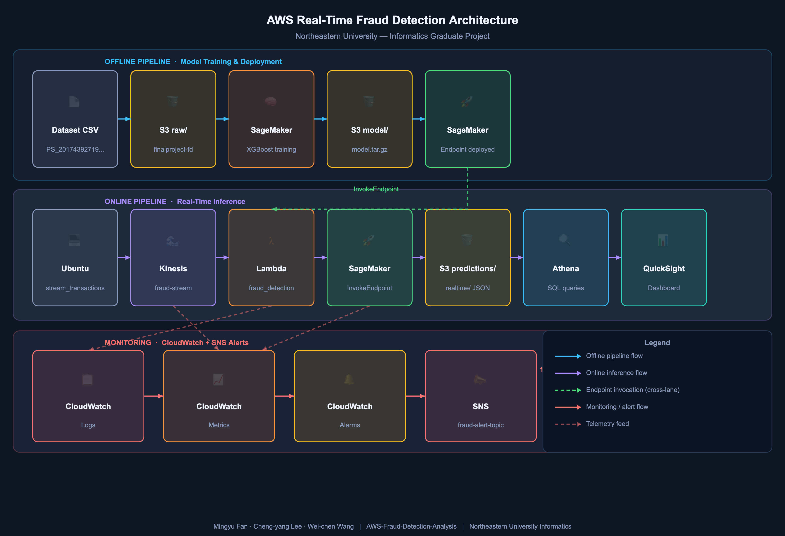

**[English](README.md) | [简体中文](README_zh_CN.md) | [繁體中文](README_zh_TW.md)**

# AWS 詐欺偵測分析

基於 AWS 建構的即時詐欺偵測流水線，整合離線 XGBoost 模型訓練、即時交易流推理、自動告警與互動式視覺化。

---

## 作者

**范明宇、李政洋、王韋辰** — 東北大學資訊學研究生  
專案儲存庫：[AWS-Fraud-Detection-Analysis](https://github.com/optimus889/AWS-Fraud-Detection-Analysis)

---

## 專案概述

本專案使用 AWS 託管服務實作端到端詐欺偵測系統。使用合成交易資料集在 SageMaker 上訓練 XGBoost 分類器；即時交易透過 Kinesis 串流流入，由 Lambda 呼叫已部署的 SageMaker 端點進行評分，預測結果儲存至 S3，可透過 Athena 查詢並在 QuickSight 中視覺化。CloudWatch 監控整條流水線，當詐欺率超過閾值時觸發 SNS 告警。

---

## 資料集

原始資料集（`PS_20174392719_1491204439457_log.csv`，約 470 MB）超出 GitHub 檔案大小限制，**未包含於本儲存庫中**，儲存於 S3，執行流水線前須先下載。

**從 S3 下載：**

```bash
aws s3 cp s3://finalproject-fraud-detection/raw/PS_20174392719_1491204439457_log.csv \
    dataset/PS_20174392719_1491204439457_log.csv
```

> 請確保 AWS CLI 已設定（`aws configure`），且憑證具有 `AmazonS3FullAccess` 或至少對 `finalproject-fraud-detection` 儲存桶的讀取權限。

**原始來源：**[PaySim 合成金融資料集 — Kaggle](https://www.kaggle.com/datasets/ealaxi/paysim1)

---

## 架構

 

### 離線流水線（模型訓練）

```
PS_20174392719_1491204439457_log.csv
    └── S3 (raw/)
        └── SageMaker XGBoost 訓練
            └── SageMaker 端點
```

### 線上流水線（即時推理）

```
本地 Ubuntu 機器
    └── src/stream_transactions.py
        └── Kinesis (fraud-stream)
            └── Lambda (fraud_detection_lambda.py)
                └── SageMaker 端點
                    └── S3 (predictions/realtime/)
                        └── Athena
                            └── QuickSight
```

### 監控

```
CloudWatch
    ├── 日誌     — Lambda 執行日誌、SageMaker 推理延遲
    ├── 指標     — 詐欺率、Kinesis 串流吞吐量、端點呼叫次數
    └── 告警     → SNS 主題 (fraud-alert-topic)
```

---

## 使用的 AWS 服務

| 服務 | 職責 |
|---|---|
| **Amazon Kinesis** | 即時交易資料接入（`fraud-stream`）；容量模式：**隨需**；最大容量：**10,240 KiB** |
| **AWS Lambda** | 對每個 Kinesis 分片記錄觸發批次推理 |
| **Amazon SageMaker** | XGBoost 模型訓練（`ml.m5.large`）及託管即時端點 |
| **Amazon S3** | 儲存原始資料、處理後資料分片、模型產物及預測結果 |
| **Amazon Athena** | 對 S3 預測結果進行 SQL 查詢 |
| **Amazon QuickSight** | 互動式詐欺分析儀表板 |
| **Amazon CloudWatch** | 流水線日誌、指標與告警監控 |
| **Amazon SNS** | 詐欺率超閾值時向 `fraud-alert-topic` 傳送告警通知 |

---

## 模型詳情

| 項目 | 值 |
|---|---|
| **演算法** | SageMaker 內建 XGBoost 1.7-1 |
| **目標函數** | `binary:logistic` |
| **評估指標** | AUC |
| **訓練輪數** | 120 |
| **訓練執行個體** | `ml.m5.large` |
| **推理閾值** | 0.5 |
| **測試準確率** | 0.9980 |
| **測試精確率** | 0.9718 |
| **測試召回率** | 0.9789 |
| **測試 F1 分數** | 0.9753 |
| **測試 ROC-AUC** | 0.9992 |

### 特徵向量（11 個特徵，順序敏感）

| # | 特徵 | 類型 |
|---|---|---|
| 1 | `step` | int |
| 2 | `amount` | float |
| 3 | `oldbalanceOrg` | float |
| 4 | `newbalanceOrig` | float |
| 5 | `oldbalanceDest` | float |
| 6 | `newbalanceDest` | float |
| 7 | `type_CASH_IN` | int（獨熱編碼） |
| 8 | `type_CASH_OUT` | int（獨熱編碼） |
| 9 | `type_DEBIT` | int（獨熱編碼） |
| 10 | `type_PAYMENT` | int（獨熱編碼） |
| 11 | `type_TRANSFER` | int（獨熱編碼） |

---

## IAM 角色與政策需求

執行專案前，請在 AWS 主控台中設定以下 IAM 角色。

### 1. 本地機器 — IAM 使用者

進入 **IAM → 使用者 → 你的使用者 → 新增權限 → 直接附加政策**：

| 受管政策 | 用途 |
|---|---|
| `AmazonS3FullAccess` | 上傳原始資料並從 S3 讀取模型產物 |
| `AmazonKinesisFullAccess` | 向 `fraud-stream` 寫入記錄 |
| `AmazonSageMakerFullAccess` | 提交訓練任務並呼叫端點 |

### 2. SageMaker 執行角色

進入 **IAM → 角色 → 建立角色 → AWS 服務 → SageMaker**：

| 受管政策 | 用途 |
|---|---|
| `AmazonSageMakerFullAccess` | 訓練、模型及端點管理 |
| `AmazonS3FullAccess` | 讀取原始/處理後資料，寫入模型產物 |
| `CloudWatchLogsFullAccess` | 將訓練日誌寫入 CloudWatch |

### 3. Lambda 執行角色

進入 **IAM → 角色 → 建立角色 → AWS 服務 → Lambda**：

| 受管政策 | 用途 |
|---|---|
| `AmazonKinesisFullAccess` | 從 `fraud-stream` 讀取記錄 |
| `AmazonSageMakerFullAccess` | 呼叫 SageMaker 推理端點 |
| `AmazonS3FullAccess` | 將預測結果寫入 `predictions/` |
| `CloudWatchLogsFullAccess` | 寫入 Lambda 執行日誌 |

### 4. CloudWatch 與 SNS

進入 **IAM → 角色 → 你的 CloudWatch 角色 → 新增權限**：

| 受管政策 | 用途 |
|---|---|
| `CloudWatchFullAccess` | 建立告警、指標和儀表板 |
| `AmazonSNSFullAccess` | 向 `fraud-alert-topic` 發布詐欺率告警 |

---

## S3 儲存桶結構

**儲存桶：** `finalproject-fraud-detection`

```
finalproject-fraud-detection/
├── raw/                        # 原始資料集 CSV
├── processed/
│   ├── train/                  # 訓練集（70%）
│   ├── validation/             # 驗證集（15%）
│   └── test/                   # 測試集（15%）
├── predictions/
│   ├── realtime/               # Lambda 逐筆推理輸出（JSON）
│   └── offline-endpoint-check/ # 端點驗證結果（CSV）
├── model/
│   ├── training-output/        # SageMaker 訓練任務輸出
│   └── xgboost/                # 複製的模型產物（model.tar.gz）
└── Athena-results/             # Athena 查詢輸出檔案
```

---

## 儲存庫結構

```
AWS-Fraud-Detection-Analysis/
├── architecture/                         # AWS 架構圖
├── dashboard/                            # QuickSight 匯出視覺化圖表
├── dataset/                              # 離線產生的交易資料集（見資料集章節）
├── lambda/
│   └── fraud_detection_lambda.py         # Lambda 處理器：解碼 → 特徵建構 → 批次推理 → S3 寫入
├── model/                                # 離線訓練的模型產物
├── sql/                                  # Athena SQL 查詢腳本
├── src/
│   └── stream_transactions.py            # 均衡池建構器與 Kinesis 串流模擬器
├── Training Model and Deploy.ipynb       # SageMaker 訓練、評估與部署筆記本
├── README.md
└── requirements.txt
```

---

## 快速開始

### 前置條件

- Ubuntu 24.04
- Python 3.10+
- AWS CLI 已設定（`aws configure`），使用 IAM 使用者憑證
- 已啟用以下 AWS 服務：Kinesis、SageMaker、Lambda、S3、Athena、QuickSight、CloudWatch、SNS

### 安裝

```bash
git clone https://github.com/optimus889/AWS-Fraud-Detection-Analysis.git
cd AWS-Fraud-Detection-Analysis
python3 -m venv venv
source venv/bin/activate
pip install -r requirements.txt
```

### 第一步 — 從 S3 下載資料集

原始資料集儲存於 S3，執行筆記本前須先下載至本地：

```bash
aws s3 cp s3://finalproject-fraud-detection/raw/PS_20174392719_1491204439457_log.csv \
    dataset/PS_20174392719_1491204439457_log.csv
```

### 第二步 — 訓練模型（SageMaker 筆記本）

在 SageMaker 筆記本執行個體中開啟並執行 `Training Model and Deploy.ipynb`，該筆記本將：

1. 從 `S3 (raw/)` 下載原始 CSV，並以分塊方式讀取前處理
2. 對交易類型進行獨熱編碼，對非詐欺記錄進行降採樣（3% 採樣）
3. 分割為訓練集/驗證集/測試集並上傳至 `S3 (processed/)`
4. 在 `ml.m5.large` 上啟動 SageMaker XGBoost 訓練任務
5. 在測試集上評估模型（ROC-AUC ≈ 0.9992）

### 第三步 — 部署 SageMaker 端點

繼續在 `Training Model and Deploy.ipynb` 中部署已訓練模型：

```python
predictor = xgb.deploy(
    initial_instance_count=1,
    instance_type="ml.m5.large",
    serializer=CSVSerializer(),
    deserializer=JSONDeserializer()
)
```

記錄已部署的端點名稱（例如 `sagemaker-xgboost-2026-03-13-23-05-26-528`），供 Lambda 設定使用。

### 第四步 — 設定 Lambda 函數

1. 在 AWS 主控台中，使用 `lambda/fraud_detection_lambda.py` 中的程式碼建立 Lambda 函數
2. 設定以下環境變數：

| 鍵 | 值 |
|---|---|
| `ENDPOINT_NAME` | 已部署的 SageMaker 端點名稱 |
| `PREDICTION_BUCKET` | 你的儲存桶名稱 |
| `PREDICTION_PREFIX` | `predictions/realtime` |

3. 設定以下 Lambda 資源設定：

| 設定 | 值 |
|---|---|
| **記憶體** | 1024 MB |
| **逾時** | 5 分鐘（300 秒） |

4. 新增指向 `fraud-stream` 的 Kinesis 觸發器
5. 附加上述 IAM 章節中定義的 Lambda 執行角色

### 第五步 — 啟動即時串流

```bash
python3 src/stream_transactions.py
```

該腳本從 S3 讀取原始 CSV，建構均衡池（預設 20% 詐欺、80% 正常），並向 `fraud-stream` 推送 1,500 筆交易。Lambda 處理每批資料，呼叫 SageMaker 端點，並將逐筆交易的 JSON 結果寫入 `s3://finalproject-fraud-detection/predictions/realtime/`。

### 第六步 — 使用 Athena 查詢結果

對預測儲存桶執行 `sql/` 中的 SQL 腳本，結果儲存至 `s3://finalproject-fraud-detection/Athena-results/`。

### 第七步 — 使用 QuickSight 視覺化

將 QuickSight 連接至 Athena 資料來源，並從 `dashboard/` 載入儀表板設定，互動式探索詐欺指標。

### 第八步 — 使用 CloudWatch 與 SNS 監控

CloudWatch 收集 Lambda 執行日誌、Kinesis 串流吞吐量及 SageMaker 端點呼叫指標。設定告警，當詐欺率超過定義閾值時，向 `fraud-alert` 觸發 SNS 通知。

---

## 授權

本專案僅供學術與教育用途。
